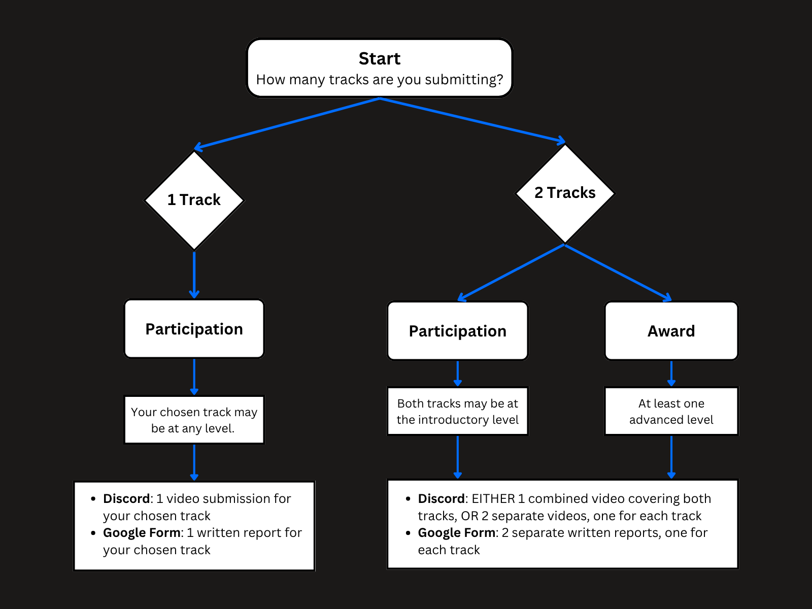

# Two Types of Deliverables

This page explains the deliverables required for Connectome2026 and how to submit them.

For the competition, you will be submitting two types of deliverables:

1. **Video submission** via Clematis Discord
2. **Written report** via Google Form

The two deliverables serve different purposes:

- **Video submission:** intended for a general audience, including people who are not neuroscientists. This is your opportunity to communicate your research journey, key ideas, and/or main findings in an accessible and engaging way.
- **Written report:** a more formal research report written for a neuroscience audience.

# Number of Deliverables

The number of deliverables depends on how many tracks you choose to submit.

## If you submit one track

You must submit:
- **one video submission** via Discord, reflecting on your journey and findings for your chosen track
- **one written report** via Google Form for your chosen track

## If you submit two tracks

You must submit:
- **Video submission via Discord:** either
  - **one combined video** covering both tracks, or
  - **two separate videos**, one for each track
- **Written report via Google Form:** **2 separate written reports**, one for each track

# Participation and Award Pathways

If you are participating for a **participation certificate**, you may submit work for **one track**.

If you are aiming to be **considered for awards**, you must submit work for **both tracks**, and **at least one track must be at the Advanced Level**.

# How to Submit Your Deliverables?

## Video Submission

All video submissions must be posted in **#Connectome2026** on the Clematis Discord server: https://tinyurl.com/discordclematis

The video submission is intended for a **general audience**, including your fellow participants and the broader Clematis community of over 1,000 learners from around the world. This is an opportunity to communicate your research journey, discoveries, challenges, and insights in an accessible and engaging way.

Unlike the written report, which is intended for a neuroscience audience, the video submission encourages you to share your work with people from a wide range of backgrounds and levels of expertise.

There is no required format for the video, but the video should be **no longer than 10 minutes**. We encourage participants to be creative and choose a style that best communicates their work. Examples include:

* Short-form videos (e.g., TikTok, Instagram Reel, YouTube Short)
* Long-form videos (e.g., videos with slides)
* Animated videos
* Screen recordings demonstrating analyses or visualizations
* Research journey or reflection videos
* Any other creative audiovisual format that effectively communicates your work

The focus is not on professional video production, but on clearly and effectively sharing your experience and/or findings.

### Video Requirements

* Submission must include a video.
* You are **not required to show your face** in the video, although you are welcome to do so if you wish.
* If your video contains narration or spoken commentary, the voice must be **your own voice**.
* Generative AI voiceovers, synthetic narration, or text-to-speech voices are **not permitted**.
* Other uses of generative AI remain subject to the competition's Generative AI policy.

### Discord Post

Participants are encouraged to include a short text caption in their Discord post describing their project, research question, findings, or learning experience.

You may upload your video directly to Discord or share a link to a video hosted on another platform, including YouTube, Google Drive, OneDrive, Dropbox, social media platforms (e.g., Instagram, Facebook, and LinkedIn). 

As long as the video is accessible to judges and organizers, participants may choose the hosting platform that works best for them.

## Written Report Submission

Please follow the guidelines and requirements for the written report corresponding to your chosen track and level.

For general guidance on scientific writing, referencing, word counts, and communicating research findings, please refer to the [Writing Guide](writing_guide).

For track-specific requirements and expectations, please consult the relevant track sections and submission instructions.

The Google Form links to submit your written report:
- **Track 1 (Flies):** https://forms.gle/zny6FE7PEEmzcbQB7 
- **Track 2 (Humans):** https://forms.gle/cgHzUadfhcTh45xK7

# Submission Flowchart

Refer to the flowchart below for a visual overview of the submission options.

## Notes

- Follow the instructions in the selection criteria and the relevant track pages for formatting and content expectations.
- If you are submitting for awards, be sure to review the eligibility requirements and selection criteria carefully.