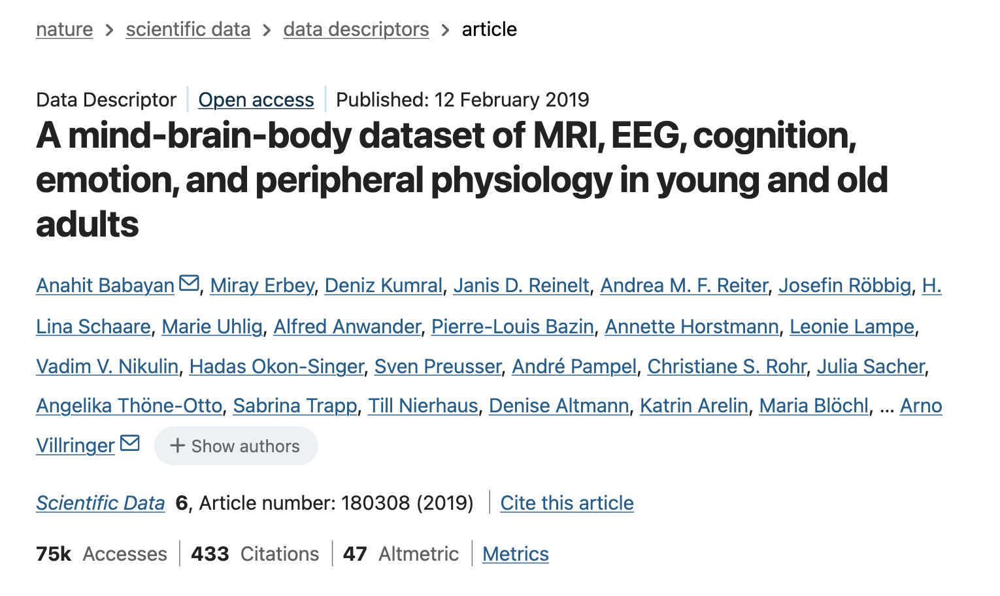

# Unresolved Questions in Cognitive Neuroscience and Neuropsychiatry

Why do people differ from one another? Why can some individuals learn new skills quickly while others struggle? Why do people differ in their personality, emotional tendencies, attention, memory, sleep patterns, and mental wellbeing? Why do some individuals remain resilient in the face of adversity? What are the underlying causes of depression, addiction, anxiety disorders, or other psychiatric conditions?

These questions lie at the heart of cognitive neuroscience and neuropsychiatry.

One possibility is that the answers are hidden within the large-scale networks of the human brain.

Over the past several decades, advances in functional magnetic resonance imaging (**fMRI**) have allowed researchers to study the activity of the living human brain non-invasively. Rather than focusing on isolated brain regions, researchers increasingly view the brain as a collection of interconnected networks that continuously communicate and coordinate with one another. This is a **macroscopic** approach to neuroscience.

These brain networks influence how we think, feel, perceive, remember, and behave. Furthermore, growing evidence suggests that differences in brain network organization may help explain differences in cognition, personality, mental health, and aging.

Yet many fundamental questions remain unresolved. Can patterns of brain connectivity predict aspects of cognition or behavior? How do brain networks change across the lifespan? Which aspects of mental health are reflected in brain activity, and which are not? Can we identify biological signatures that help explain why people differ from one another?

---

# Connecting the Mind, Brain, and Body

Increasingly, researchers recognize that the mind, brain, and body are deeply interconnected.

Mental health is influenced not only by brain activity, but also by physiology, lifestyle, genetics, development, and environmental factors. Likewise, physical health can influence cognition, mood, and behavior. Understanding these complex interactions is one of the major challenges facing modern neuroscience and medicine.

This challenge has contributed to a growing movement toward **precision medicine** and **precision psychiatry**. Rather than treating all individuals with the same diagnosis as identical, these approaches seek to understand the biological and psychological factors that contribute to differences between individuals. Furthermore, precision psychiatry seeks to identify **biomarkers** (i.e., measurable biological indicators such as brain function) that may help improve diagnosis, predict disease progression, or guide treatment decisions. Achieving this goal requires researchers to integrate information across many domains, including brain imaging, physiology, cognition, behavior, and psychiatry.

To support this effort, the last decade has seen the emergence of large-scale datasets that collect rich measurements spanning the mind, brain, and body.

In this competition, you will explore one such dataset.

---

# The Leipzig Mind-Brain-Body (LEMON) Dataset

You will work with the [**Leipzig Mind-Brain-Body (LEMON) dataset**](https://www.nature.com/articles/sdata2018308), collected by researchers at the **Max Planck Institute for Human Cognitive and Brain Sciences** in Leipzig, Germany.

This large-scale dataset contains information from approximately **220 younger and older adults**, combining neuroimaging, cognitive, psychological, psychiatric, physiological, and demographic measurements.

In addition to functional MRI (fMRI) data, the dataset includes:

* Continuous cardiovascular measurements collected during fMRI, including blood pressure, heart rate, pulse, and respiration
* Anthropometric measurements
* Blood samples and urine drug screening
* Structured psychiatric assessments, including measures related to depression and other psychiatric symptoms
* Multiple cognitive tests assessing different aspects of cognition
* More than twenty questionnaires covering personality traits, emotional functioning, eating behavior, addictive tendencies, and other psychological characteristics

This rich combination of measurements provides an opportunity to investigate relationships between brain function, cognition, behavior, mental health, physiology, and aging.

---

# Your Goal

Your goal is to leverage this dataset to investigate meaningful questions about the relationships between brain networks, cognition, behavior, physiology, and mental health.

For example, you might explore questions such as:

* Are age-related changes in cognition accompanied by changes in the organization of large-scale brain networks?
* Do physiological measures such as heart rate, blood pressure, or respiration relate to patterns of intrinsic brain activity?
* Can relationships between brain connectivity and cognition be partially explained by physiological factors?
* Do graph-theoretical properties of brain networks (e.g., modularity, efficiency, clustering coefficient, or centrality) relate to cognition, personality, or mental health measures?
* Can machine learning models predict age, cognitive performance, personality traits, or physiological measures from brain-based measures?
* Which functional connections contribute most strongly to predictions made by machine learning models?
* Are there subgroups of participants with distinct brain network profiles, and do these subgroups differ psychologically or physiologically?

These questions are only intended as examples. We encourage you to ask your own questions based on the literature and your interests!

To summarize, this track encourages you to investigate how large-scale functional brain networks relate to cognition, behavior, physiology, psychological traits, mental health, and aging.

---

# Barriers to Neuroimaging Research

Neuroscience is one of the most interdisciplinary areas of modern science. 

To analyze a large-scale neuroimaging dataset, researchers often draw knowledge from cognitive neuroscience, human neuroanatomy, statistics (e.g., generalized linear modelling, dimensionality reduction), machine learning (e.g., SVM), network science, programming (e.g., Python, MATLAB, bash or command line), pre-processing and analyzing neuroimaging data (e.g., FSL, Freesurfer, fMRIprep, AFNI), and data visualization. 

In addition, neuroimaging datasets are often extremely large. Raw and processed imaging data can easily exceed hundreds of gigabytes, creating substantial computational and technical challenges.

As a result, entering the field can sometimes feel overwhelming. With that said, we are excited to make this journey a very exciting one! 

---

# How We Will Help You

One of the goals of Connectome2026 (Track 2) is to make neuroimaging accessible to students regardless of their prior background.

We have carefully designed this track so that participants can focus on learning and scientific discovery rather than spending months navigating the technical barriers that often accompany neuroimaging research.

Throughout this track, we will provide structured guidance, tutorials, code examples, and learning resources to help you understand exactly what you need to know to begin asking meaningful scientific questions.

Our goal is not to teach every aspect of neuroimaging from the very beginning. Instead, we aim to provide a strong foundation and a practical roadmap that allows you to understand the core concepts, perform meaningful analyses, and identify directions for further learning. This way, you are learning in a hands-on manner and we hope that you feel inspired to pursue further studies in neuroscience!

To make participation accessible, we have also prepared the data in a format that allows all analyses taught within the competition to be performed on a standard laptop. These analyses that you will be learning are fundamental to neuroimaging research, and may be sufficient to publish in a peer-reviewed journal. Participants will not need access to specialized computing infrastructure to complete the competition.

For participants interested in exploring other analysis techniques, which may require you to have certain technical specifications, we will also provide resources on such topics. However, these additional steps are entirely optional and are **not required** for success in the competition.

---

# Introductory and Advanced Levels

This track contains both **Introductory** and **Advanced** levels.

## Introductory Level

The Introductory Level focuses on developing foundational skills in neuroimaging analysis and scientific communication.

Participants will work through guided analyses using provided code and resources, reproduce key analyses on their own computer, and perform small extensions or exploratory investigations. The final deliverable is a **Guided Research Commentary**, where participants summarize their findings and reflect on what they learned from the dataset.

## Advanced Level

The Advanced Level is intended for participants who wish to pursue a more independent and in-depth investigation.

While using many of the same datasets and tools as the Introductory Level, participants are encouraged to formulate their own research questions, perform deeper analyses, explore additional methodologies, and develop novel insights from the data. This level places greater emphasis on independent scientific inquiry, critical thinking, and scientific communication through a research manuscript.
